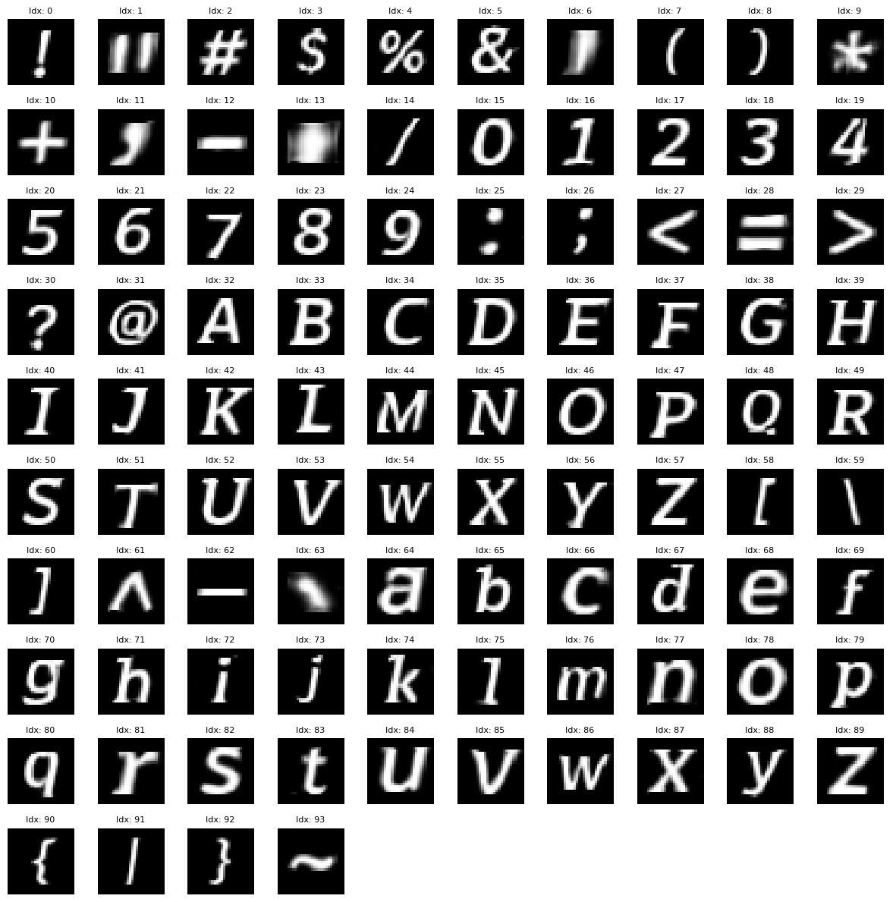
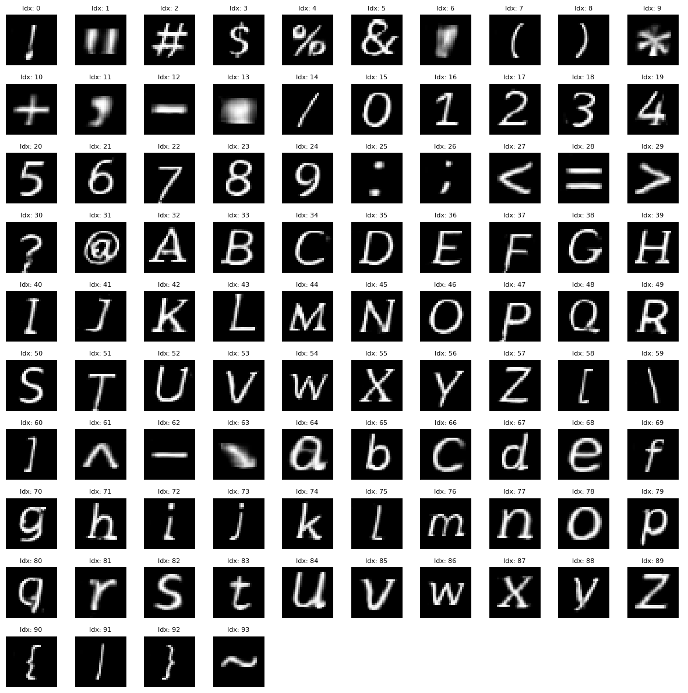

# Font Generation using Conditional GAN

**Author:** Kalp Shah  
**Institution:** Indian Institute of Technology Gandhinagar

A deep learning project that generates new fonts using Conditional Generative Adversarial Networks (cGAN). The model learns to generate diverse character styles (bold, italic, light, regular) from the TMNIST dataset.

---

## Project Overview

This project implements a Conditional GAN to generate synthetic font characters with specific style conditions. The generator learns to create realistic 28×28 grayscale images of alphabetic characters that conform to specified font styles.

**Key Features:**
- Conditional generation based on font styles (Bold, Italic, Light, Regular)
- Trained on 281,000+ characters from the TMNIST dataset
- Pre-trained generator and discriminator weights included
- Generates all 94 alphabetic characters + symbols

---

## Dataset: Typography MNIST (TMNIST)

The project uses the [TMNIST Alphabet Dataset](https://www.kaggle.com/datasets/nikbearbrown/tmnist-alphabet-94-characters) from Kaggle, curated by **NIKBEARBROWN**.

**Dataset Details:**
- **94 character types:** 0-9, a-z, A-Z, and 30 special characters
- **281,000+ images** across different fonts
- **Format:** CSV with 784 pixel columns (28×28 grayscale images)
- **Font varieties:** Acme, Zilla Slab, and many others with different styles

---

## Model Architecture

### Conditional GAN Components

**Generator:**
- Takes noise vector + one-hot encoded condition vector as input
- Upsamples through deconvolutional layers
- Generates 28×28 character images with Tanh activation

**Discriminator:**
- Processes both real/generated images and conditions
- Uses convolutional layers to extract features
- Binary classification output (real vs. generated)

### Conditioning Mechanism

Style conditions are extracted from font names:
- **Bold:** Fonts containing "Bold"
- **Italic:** Fonts containing "Italic"
- **Light:** Fonts containing "Light"
- **Regular:** Fonts containing "Regular"

---

## Example Outputs

### Italic and Bold Combination


### Only Italics Generation


---

## Getting Started

### Requirements
- Python 3.7+
- PyTorch
- NumPy, Pandas
- Scikit-learn
- Jupyter Notebook

### Installation

```bash
# Clone the repository
git clone <repository-url>
cd FontGenerationCGAN

# Install dependencies
pip install torch torchvision pandas numpy scikit-learn jupyter

# Download pre-trained weights (included in repo)
```

### Usage

1. **Open the notebook:**
   ```bash
   jupyter notebook cGAN_Font_Generation.ipynb
   ```

2. **Load pre-trained weights:**
   ```python
   generator = torch.load('cgan_generator_weights.pth')
   discriminator = torch.load('cgan_discriminator_weights.pth')
   ```

3. **Generate new fonts:**
   ```python
   noise = torch.randn(batch_size, latent_dim)
   condition = torch.tensor([...])  # Style condition
   generated_images = generator(noise, condition)
   ```

---

## File Structure

```
FontGenerationCGAN/
├── cGAN_Font_Generation.ipynb          # Main training/inference notebook
├── cgan_generator_weights.pth          # Pre-trained generator weights
├── cgan_discriminator_weights.pth      # Pre-trained discriminator weights
├── italic_only_generation.png          # Example output (italic style)
├── both_italic_and_bold.png            # Example output (multiple styles)
└── README.md                            # This file
```

---

## Results

The trained cGAN successfully generates:
- Realistic character representations across all 94 characters
- Style-consistent fonts (italic, bold, light variations)
- Smooth transitions between different font styles
- High-quality 28×28 pixel character images

---

## References

- **Dataset:** [TMNIST - Kaggle](https://www.kaggle.com/datasets/nikbearbrown/tmnist-alphabet-94-characters)
- **GAN Paper:** [Conditional Generative Adversarial Nets (Mirza & Osindski, 2014)](https://arxiv.org/abs/1411.1784)
- **Deep Learning Framework:** [PyTorch](https://pytorch.org/)

---

## License

This project is provided as-is for educational purposes.

---

*For questions or improvements, feel free to reach out!*
